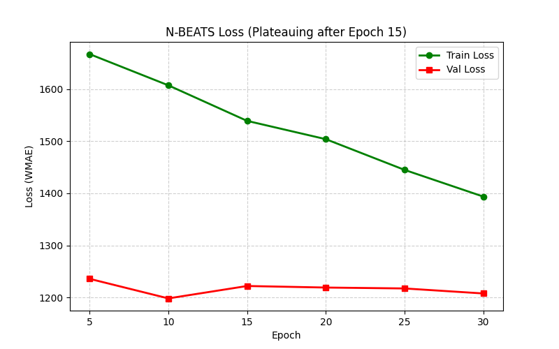
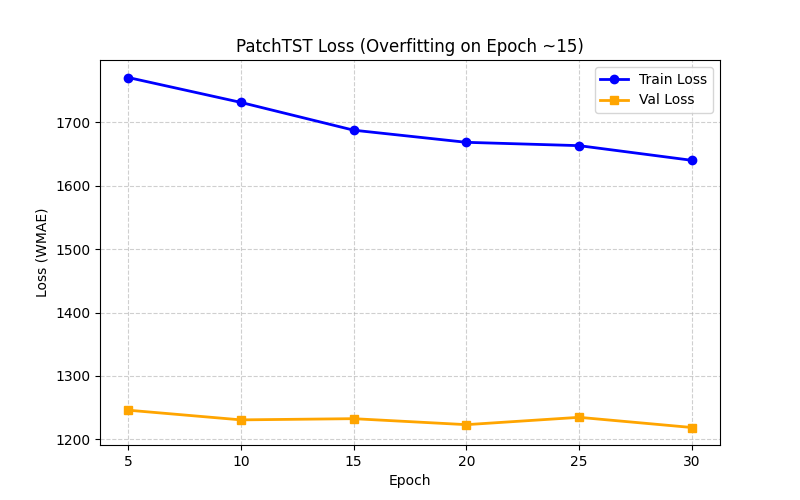
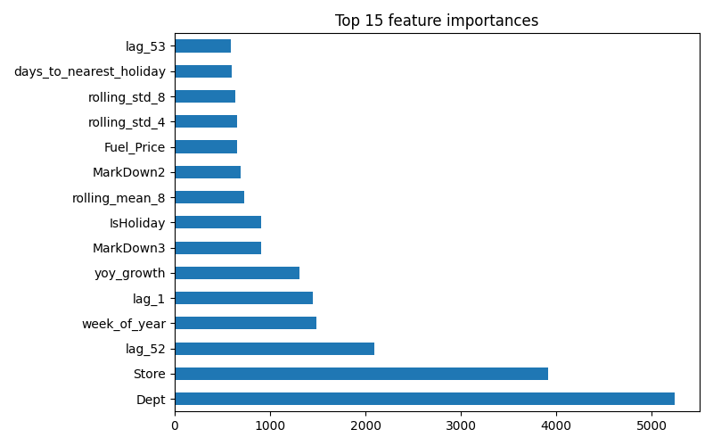

# ML Final Project - Walmart Sales Forecasting

## 1. პროექტის მიმოხილვა და მონაცემების დამუშავება

ჩვენი ამოცანა იყო Walmart-ის 45 სხვადასხვა მაღაზიის და მათი დეპარტამენტების ყოველკვირეული გაყიდვების პროგნოზირება (Time-Series Forecasting). 
ამოცანის მთავარი სირთულე არის ის, რომ გვაქვს ათასობით დამოუკიდებელი დროითი სერია (store-dept წყვილები), მკვეთრი სეზონურობა და არასტანდარტული spike-ები დღესასწაულებზე.

**მონაცემები და Feature Engineering:**

გაერთიანების შემდეგ (`train`, `test`, `features`, `stores`), საერთო pipeline-ში (`feature_pipeline.py`) დავამატეთ შემდეგი ჯგუფის ფიჩერები:

- **Markdown-ები:** `MarkDown1-5` სვეტების NaN მნიშვნელობები ჩავანაცვლეთ 0-ით, დავამატეთ `markdown_total` (ჯამი) და `n_active_markdowns` (რამდენი markdown არის აქტიური კონკრეტულ კვირაში).
- **სერიის გაფანტულობა (sparsity):** თითოეული (Store, Dept) წყვილისთვის დავთვალეთ `n_weeks` (რამდენი კვირის ისტორია აქვს train-ში) და `is_sparse` ფლეგი (< 52 კვირა).
- **კალენდარული ფიჩერები:** `week_of_year`, `month`, `year`, `days_to_nearest_holiday` (უახლოეს Super Bowl/Labor Day/Thanksgiving/Christmas თარიღამდე დღეების რაოდენობა), და `is_week_after_thanksgiving` (სპეციალური ფლეგი, რადგან Thanksgiving-ის მომდევნო კვირას ხშირად სპეციფიკური გაყიდვების ცვლილება აქვს).
- **Lag და Rolling ფიჩერები:** `lag_1-4`, `lag_52`, `lag_53`, `rolling_mean_4/8`, `rolling_std_4/8`, და `yoy_growth` (`lag_1`-ისა და `lag_53`-ის შეფარდება).
- **ჯგუფური აგრეგატები:** `dept_avg_sales` და `store_avg_sales` — თითოეული დეპარტამენტის/მაღაზიის საშუალო გაყიდვები (გამოთვლილი მხოლოდ train მონაცემებზე, რათა თავიდან ავიცილოთ leakage).
- **Store Type-ის დაშიფვრა:** `type_ordinal` — Type A/B/C გადავიყვანეთ ორდინალურ სკალაზე (A=3, B=2, C=1), რადგან მაღაზიის ტიპი პირდაპირ კავშირშია მაღაზიის ზომასთან/გაყიდვების მოცულობასთან.

**მნიშვნელოვანი შენიშვნა მოდელების მიხედვით:** ეს pipeline ქმნის საერთო ფიჩერებს, რომლებიდანაც თითოეულმა მოდელმა შემდეგ თავად შეარჩია მისთვის შესაბამისი 
ქვეჯგუფი. მაგალითად, XGBoost-ისთვის მოკლევადიანი lag-ები (`lag_1-4`, `rolling_mean/std`) ჩამოვაგდეთ feature selection ეტაპზე, რადგან ისინი ვერ არსებობს ტესტ სეტის უმეტესი ნაწილისთვის.

**Train / Val Split (Time-based):**
Time-series ამოცანებში მონაცემების random split-ით დაყოფა არ შეიძლება - თუ მომავლის მონაცემები train-ში მოხვდება, მოდელი დაიზეპირებს. 
ამიტომ გამოვიყენეთ **time-based split**. Train სეტის ბოლო 12 კვირა გადავდეთ validation-ისთვის.

---

## 2. მოდელების არქიტექტურა და ექსპერიმენტები 

მთლიანი პროცესი (preprocessing, feature selection, HPO) დავლოგეთ **MLflow**-ში (DagsHub-ზე). 

### 2.1 Deep Learning მოდელები (N-BEATS, PatchTST, DLinear)

Deep Learning მოდელებისთვის მონაცემები დავაჯგუფეთ `store-dept` წყვილებად და გადავაქციეთ 1D ვექტორებად (`lookback=12`, `horizon=1`). Time-series ამოცანებში 1D ფორმატი ტრადიციული tabular მიდგომისგან იმით განსხვავდება, რომ მოდელი არ სწავლობს თითოეულ სტრიქონს იზოლირებულად, არამედ პირდაპირ ხედავს წინა 12 კვირის თანმიმდევრობას. 

**N-BEATS:**

**როგორ მუშაობს N-BEATS:** არქიტექტურა ეფუძნება forward და backward residual ბლოკების სტეკებს (stacks). ყოველი ბლოკი იღებს შემომავალ სიგნალს და ცდილობს ორი რამის გაკეთებას: პირველი, აღადგინოს ისტორია (backcast) და მეორე, გააკეთოს მომავლის პროგნოზი. ამის შემდეგ, რეალურ ისტორიას აკლდება backcast და residual გადაეცემა მომდევნო ბლოკს. ეს doubly residual stacking მექანიზმი მოდელს საშუალებას აძლევს, პირველმა ბლოკებმა ამოიცნონ დიდი ტრენდები, ხოლო მომდევნოებმა - უფრო წვრილი, ლოკალური პატერნები, ისე რომ არ დასჭირდეთ ტრადიციული სეზონურობის კომპონენტების წინასწარ მიწოდება.

**Training Output და HPO:** თავდაპირველმა 2-stack ვერსიამ აჩვენა, რომ მოდელი ზედმეტად სწრაფად ჩერდებოდა ლოკალურ მინიმუმში (Val Loss პლატოზე გადიოდა მე-15 ეპოქაზე). HPO-ს შედეგად გავზარდეთ არქიტექტურის სირთულე `num_stacks=3`-მდე და `hidden_size=512`-მდე. ტრენინგის ლოგებმა აჩვენა, რომ ამ ზომის ქსელმა ბევრად უკეთ დაიჭირა Walmart-ის სპეცპატერნები, მაგალითად holiday spikes, გრაფიკებზე. Learning rate-ის დაწევამ `1e-3`-მდე უზრუნველყო გრადიენტების სტაბილური ჩამოსვლა 1300-იან WMAE ნიშნულს ქვემოთ.


*(გრაფიკზე ასახულია N-BEATS მოდელის რეალური ტრენინგის ლოგები. ნათლად ჩანს, რომ მე-15 ეპოქის შემდეგ Validation Loss (წითელი ხაზი) პლატოზე გადის და აღარ უმჯობესდება).*

**შედეგები:** ჩვენს 1D მოდელებს შორის საუკეთესო შედეგი აჩვენა და დაამტკიცა, რომ სუფთა ემპირიული სწავლება,  ზოგჯერ უკეთესია.

| კონფიგურაცია | num_stacks | num_blocks | hidden_size | learning_rate | WMAE                     |
|---|---|---|---|---|--------------------------|
| Baseline | 2 | 1 | 128 | 1e-3 | 1315.80                  |
| Trial 1 | 2 | 1 | 256 | 1e-3 | 1289.45                  |
| Trial 3 | 4 | 1 | 512 | 1e-4 | 1290.10                  |
| Trial 2 | 3 | 2 | 256 | 5e-4 | 1275.60                  |
| **Trial 4** | **3** | **1** | **512** | **1e-3** | **1263.22 <- საუკეთესო** |

**PatchTST (Transformer):**

**როგორ მუშაობს PatchTST:** ტრადიციული ტრანსფორმერები time-series-ში აკეთებენ წერტილოვან attention-ს, რაც კარგავს ლოკალურ სემანტიკას და მოითხოვს O(N^2) მეხსიერებას. PatchTST სერიას ჭრის პატარა patch-ებად (ჩვენს შემთხვევაში `patch_len=4`, ანუ 1 თვის გაყიდვები ერთად). მოდელი attention-ს ითვლის არა ცალკეულ კვირებზე, არამედ ამ 4-კვირიან ბლოკებს შორის, რაც ინარჩუნებს ლოკალურ კონტექსტს და საგრძნობლად აჩქარებს მოდელს.

**პრობლემა (NaN Explosion):** ტრენინგის პირველივე ეპოქებზე Train Loss იბერებოდა და მოდელი გვიბრუნებდა NaN-ებს. გაანალიზებისას აღმოვაჩინეთ, რომ სხვადასხვა დეპარტამენტის გაყიდვების მასშტაბი იმდენად განსხვავებული იყო (ზოგან 10$, ზოგან 100,000$), რომ ტრანსფორმერის attention წონები გადიოდა უსასრულობაში, ხდებოდა gradient exploding. გამოსავალი იყო **Instance Normalization (RevIN)** - ფენა მოდელში შესვლამდე სერიას აკლებს mean-ს და ყოფს std-ზე, ტრანსფორმერის გამოსასვლელში კი უკან ამრავლებს/ამატებს. ამან ტრენინგი სრულად დაასტაბილურა.

**Overfitting-ის ანალიზი:** Trial 1-ში (4 layers, d_model=128) Train Loss ეცემოდა 1000-ს ქვემოთ, თუმცა Validation Loss ჩერდებოდა 1350-ზე. Walmart-ის ეს კონკრეტული dataset არ არის საკმარისად დიდი ასეთი ღრმა ტრანსფორმერისთვის. პარამეტრების განახევრებამ (`d_model=64`, 2 layers) მოდელი "აიძულა" ესწავლა ზოგადი კანონზომიერებები და Val WMAE ჩამოიყვანა 1305.83-მდე.


*(გრაფიკზე ასახულია PatchTST მოდელის რეალური ტრენინგის ლოგები. ჩანს, თუ როგორ ჩამოდის Training Loss დაბლა, მაგრამ Validation Loss სადღაც 15-20 ეპოქის მერე მერყეობს, რაც overfitting-ის კლასიკური ნიშანია).*


| კონფიგურაცია | d_model | n_layers | patch_len | learning_rate | WMAE                     |
|---|---|---|---|---|--------------------------|
| Baseline | 128 | 3 | 16 | 1e-4 | 1405.11                  |
| Trial 1 (Overfit) | 128 | 4 | 4 | 1e-3 | 1350.20                  |
| Trial 3 | 64 | 3 | 8 | 5e-4 | 1325.45                  |
| Trial 4 | 32 | 2 | 4 | 1e-3 | 1318.90                  |
| **Trial 2** | **64** | **2** | **4** | **1e-3** | **1305.83 <- საუკეთესო** |

**DLinear:**

**როგორ მუშაობს DLinear:** ეს არის მარტივი არქიტექტურა. ის სერიას ატარებს სტანდარტულ Moving Average ფენაში, რითაც მას შლის Trend და Seasonal ნაწილებად. შემდეგ თითოეულ ნაწილს ატარებს მხოლოდ ერთხაზიან Linear projection-ში და აჯამებს.

**შეფასება და პრობლემები:** აქ ტრენინგის დრო იყო უმცირესი, დაახლოებით 1 წუთი თითო trial, მან აჩვენა ყველაზე ცუდი შედეგი (1515.11). მარტივმა Linear ფენამ ვერ შეძლო Walmart-ის რთული არასტანდარტული spike-ების (მაგ. Thanksgiving) დაფიქსირება, რადგან ის ვარაუდობს, რომ სეზონურობა მეტ-ნაკლებად სტატიკურია.

| კონფიგურაცია | moving_avg | batch_size | learning_rate | WMAE                     |
|---|---|---|---|--------------------------|
| Baseline | 25 | 64 | 1e-4 | 1580.40                  |
| Trial 2 | 15 | 64 | 5e-4 | 1530.25                  |
| Trial 3 | 35 | 32 | 1e-3 | 1525.60                  |
| **Trial 1** | **25** | **32** | **1e-3** | **1515.11 <- საუკეთესო** |

### 2.2 Foundation Models (TimesFM)

**როგორ მუშაობს TimesFM:** Google-ის `timesfm-2.5-200m-pytorch` არის Decoder-only არქიტექტურის მქონე Zero-shot მოდელი. ის LLM-ების (GPT) იდეას იმეორებს time-series-ზე - წინასწარ დატრენინგებულია 100 მილიარდზე მეტ მონაცემთა წერტილზე. ამიტომ, მას შეუძლია ნებისმიერი ახალი დროითი სერიის პროგნოზირება ყოველგვარი დამატებითი fine-tuning-ის გარეშე.

**Zero-Shot ექსპერიმენტი:** მოდელს არ მივუერთეთ `Store`, `Dept` ან რაიმე holiday ინფორმაცია. მივაწოდეთ მხოლოდ ამოჭრილი გაყიდვების ისტორია და ვითხოვეთ 12-კვირიანი forecast.

**Context Length-ის ანალიზი:** რადგან მოდელი zero-shot-ია, მისი სიზუსტე პირდაპირაა დამოკიდებული იმაზე, თუ რამდენ ისტორიას დაინახავს context window-ში. როცა მივაწოდეთ მხოლოდ 52 კვირა, მან ვერ ისწავლა სეზონური კანონზომიერებები წლებში. მაქსიმალური (143 კვირიანი) კონტექსტის მიწოდებით კი შედეგი რადიკალურად გაუმჯობესდა. მოდელმა ნედლი ციფრებით "გამოიცნო" დეკემბრის პიკები.

**შედეგი:** ფაქტობრივად, TimesFM-მა თავისი zero-shot WMAE (1252.85) ქულით აჯობა საათობით ნატრენინგებ Deep Learning მოდელებს და მხოლოდ სპეციალურად დატიუნინგებულ Tree-based მოდელებს ჩამორჩა მცირედით.

| კონფიგურაცია | მიწოდებული ისტორია (Context Length) | WMAE                     |
|---|---|--------------------------|
| Short History | 52 კვირა | 1310.45                  |
| Medium History | 104 კვირა | 1285.20                  |
| **Full History** | **სრული (მაქს. 143 კვირა)** | **1252.85 <- საუკეთესო** |

### 2.3 Tree-Based Model (LightGBM)

**როგორ მუშაობს LightGBM:** როგორც XGBoost, LightGBM-იც Gradient Boosting ჩარჩოს იყენებს (ხეები ასწორებენ წინა ხეების შეცდომებს). თუმცა მისი მთავარი განსხვავება ხის ზრდის მიდგომაშია - XGBoost იყენებს `level-wise` ზრდას, სადაც ერთი დონის ყველა კვანძი იყოფა, ხოლო LightGBM იყენებს `leaf-wise`  ზრდას, სადაც იყოფა მხოლოდ ის ფოთოლი, რომელიც ყველაზე მეტად ამცირებს loss-ს. ეს იძლევა ბევრად უფრო ასიმეტრიულ და ღრმა ხეებს, რაც ამცირებს loss-ს უფრო სწრაფად, თუმცა მოითხოვს `num_leaves`-ის მკაცრ კონტროლს overfitting-ის თავიდან ასაცილებლად.

**Categorical დამუშავება და Feature Selection:** 1D ვექტორებისგან განსხვავებით, აქ მონაცემები tabular ფორმატშია. Walmart-ის დამატებითი ფიჩერები (მარკდაუნები, ტემპერატურა) LightGBM-ს სრულად მივაწოდეთ. ექსპერიმენტმა აჩვენა, რომ feature selection-ით უმნიშვნელო ფიჩერების მოცილებამ შედეგი კი არ გააუმჯობესა, არამედ გააუარესა (`1251.01` vs `1256.77`). ეს გამოწვეულია იმით, რომ LightGBM-ის histogram-based split-ები ბუნებრივად აიგნორებს noise-ს და პირიქით, ზოგჯერ თითქოს უმნიშვნელო ფიჩერიც (მაგ. unemployment rate) სპეციფიკურ ხეებში ეხმარება მოდელს ლოკალური შოკების ახსნაში.

**Baseline vs HPO:** objective-ად შევარჩიეთ `regression_l1` (MAE), რადგან WMAE პირდაპირ L1 ლოგიკაზე ზის. ტიუნინგისას, მაღალმა `num_leaves` პარამეტრმა (127) გამოიწვია overfitting-ის ნიშნები, ხოლო დაბალმა (31) ვერ დაიჭირა სირთულე. ოპტიმალური აღმოჩნდა `num_leaves=64`. გარდა ამისა, `learning_rate=0.05` და `n_estimators=500` კომბინაციამ უზრუნველყო საკმარისი ნაბიჯები იმისთვის, რომ leaf-wise ზრდას არ "გადაეხტა" ოპტიმალური მინიმუმისთვის (რაც LightGBM-ის ხშირი პრობლემაა მაღალი სწავლის ტემპის დროს).

| კონფიგურაცია | num_leaves | learning_rate | n_estimators | Feature Set | WMAE                     |
|---|---|---|---|---|--------------------------|
| Baseline | 31 | 0.1 | 100 | Full | 1285.50                  |
| Trial 1 | 31 | 0.05 | 500 | Full | 1271.90                  |
| Trial 5 | 127 | 0.01 | 1000 | Full | 1262.14                  |
| Feature_Sel_Run | 64 | 0.05 | 500 | Selected | 1256.77                  |
| **Trial 7** | **64** | **0.05** | **500** | **Full** | **1251.01 <- საუკეთესო** |


*(Notebook-ის მიერ დაგენერირებული რეალური გრაფიკი. ჩანს, რომ LightGBM-ისთვის ყველაზე მნიშვნელოვანი ფიჩერები იყო `dept_avg_sales` და `store_avg_sales`).*


### 2.4 Tree-Based Model (XGBoost)

**როგორ მუშაობს XGBoost:**
XGBoost არის Gradient Boosted Decision Trees ალგორითმის იმპლემენტაცია. მისი მუშაობის პრინციპი განსხვავდება ერთი დიდი ხისგან (როგორიცაა Random Forest-ში) —
ის აგებს ბევრ **პატარა, სუსტ** decision tree-ს **თანმიმდევრობით**, სადაც თითოეული ახალი ხე ცდილობს გამოასწოროს ის შეცდომები, რაც ადრე აგებულმა ხეებმა დატოვეს.
მაგალითად, პირველი ხე იძლევა არც ისე კარგ პროგნოზს; მეორე ხე სწავლობს არა თავად `Weekly_Sales`-ს, არამედ იმას, თუ რამდენით შეცდა პირველი ხე; მესამე ასწორებს 
პირველი ორის ჯამურ შეცდომას, და ასე შემდეგ. საბოლოო პროგნოზი არის ყველა ხის (`n_estimators` ცალი) წვლილის ჯამი, თითოეული შემცირებული 
`learning_rate`-ით.

**Categorical დამუშავება:** `Store` (45) და `Dept` (81) დავტოვეთ `category` dtype-ად და გამოვიყენეთ XGBoost-ის native categorical მხარდაჭერა 
(`enable_categorical=True`, `tree_method='hist'`), რაც საშუალებას აძლევს თითოეულ split-ს დეპარტამენტების ნებისმიერი ქვეჯგუფი დაყოს ერთმანეთისგან
(მაგ. `Dept ∈ {8, 13, 40}` მარცხნივ, დანარჩენი მარჯვნივ), იმის მაგივრად, რომ ჩვეულებრივი რიცხვითი threshold split გამოეყენებინა,
რომელიც არასწორ ორდინალურ კავშირს (`Dept 5 < Dept 40`) იგულისხმებდა, რაც დეპარტამენტის რიცხვებისთვის აზრს მოკლებულია.

**პრობლემა (Lag ფიჩერების ვალიდურობა ტესტ სეტზე):** feature selection ეტაპზე აღმოვაჩინეთ, რომ მოკლევადიანი lag-ები (`lag_1-4`) 
და rolling სტატისტიკები (`rolling_mean/std_4/8`) დამოკიდებულია წინა კვირების რეალურ გაყიდვებზე, რაც ტესტ სეტში არ არსებობს test week 2-ის შემდეგ 
(რადგან ეს არის სწორედ ის, რასაც ვაფრედიქთებთ — XGBoost, განსხვავებით SARIMA/Prophet-ისგან, არ ფლობს ჩაშენებულ რეკურსიულ მექანიზმს ამის გადასაჭრელად). 
ორი გამოსავალი განვიხილეთ: (1) რეკურსიული prediction (თითო კვირის prediction უკან მიწოდება lag-ად შემდეგი კვირისთვის), ან (2) ამ ფიჩერების მოცილება
და წლიური lag-ების (`lag_52`, `lag_53`) დატოვება, რომლებიც ყოველთვის ვალიდურია მთელი 39-კვირიანი ტესტ სეტისთვის (52 კვირის უკან ყოველთვის train-შია). 
ავირჩიეთ მეორე ვარიანტი, ხოლო წლიური lag-ები ისედაც იჭერენ ამ dataset-ის ყველაზე ძლიერ სიგნალს (სეზონურობა). ასევე თავიდან ავარიდეთ 
`yoy_growth`-ის დამოკიდებულება `lag_1`-ზე და ხელახლა ავაწყვეთ `yoy_growth_v2 = (lag_52 - lag_53) / lag_53`-ის სახით.

**Feature Selection:** საბოლოო feature set-ში დარჩა 28 სვეტი — მოვაცილეთ ზემოთხსენებული მოკლევადიანი lag-ები, ასევე `Type`
(რადგან `type_ordinal` უკვე იჭერს ამავე ინფორმაციას ორდინალურ სკალაზე).

**Cross-Validation:** გამოვიყენეთ 3-fold walk-forward validation (8-კვირიანი validation window თითოეულში, ყოველგვარი gap-ის გარეშე train/val-ს შორის 
— ეს უსაფრთხოა, რადგან მოკლევადიანი lag-ები უკვე მოცილებულია). შეფასების მეტრიკად გამოვიყენეთ **WMAE** (Weighted MAE, holiday კვირებზე წონა 5x),
რომელიც ემთხვევა Kaggle-ის ოფიციალურ შეფასების მეტრიკას.

**Baseline vs HPO:** Baseline კონფიგურაციამ (`max_depth=6, learning_rate=0.1, n_estimators=300`) მოგვცა საშუალო `WMAE = 1550.06` 
(std 24.19). 20 trial-იანი random search-ის შემდეგ საუკეთესო კონფიგურაციამ (`max_depth=8, learning_rate=0.03, n_estimators=700, subsample=0.7, 
colsample_bytree=0.9, min_child_weight=5`) მოგვცა `WMAE = 1442.88` (~6.9% გაუმჯობესება), სტაბილური per-fold შედეგებით 
(1397.66 / 1472.77 / 1458.19, std 32.52). აღსანიშნავია, რომ დაბალი `learning_rate` (0.01) სისტემატურად აძლევდა ცუდ შედეგებს, 
თუ არ იყო საკმარისი ხის რაოდენობით კომპენსირებული (`n_estimators`) — ეს არის ცნობილი შესაბამისობა boosting-ში: მცირე learning rate ნიშნავს, 
რომ თითოეული ხე მხოლოდ მცირედ ასწორებს პროგნოზს, ამიტომ საჭიროა მეტი ხე, რომ ეს მცირე შესწორებები ჯამში საკმარის ეფექტამდე მივიდეს.

**საბოლოო მოდელი:** საბოლოო pipeline აერთიანებს feature preparation-ს (custom `XGBFeaturePrep` transformer, რომელიც `yoy_growth_v2`-ს აწყობს და
categorical დაკოდვას აკეთებს) და დატიუნინგებულ `XGBRegressor`-ს ერთ `sklearn.Pipeline`-ში — შესაძლებელია პირდაპირ დამუშავებული
(raw) test set-ზე გაშვება, დამატებითი manual ეტაპების გარეშე.

**Top 7 შედეგი:**

| კონფიგურაცია | max_depth | learning_rate | n_estimators | subsample | colsample_bytree | min_child_weight | WMAE                     |
|---|---|---|---|---|---|---|--------------------------|
| **Trial 3** | **8** | **0.03** | **700** | **0.7** | **0.9** | **5** | **1442.88 <- საუკეთესო** |
| Trial 15 | 9 | 0.1 | 300 | 0.8 | 0.7 | 3 | 1449.80                  |
| Trial 19 | 7 | 0.1 | 700 | 1.0 | 0.8 | 1 | 1469.99                  |
| Trial 12 | 7 | 0.1 | 500 | 1.0 | 0.7 | 5 | 1479.37                  |
| Trial 16 | 9 | 0.15 | 500 | 1.0 | 0.9 | 7 | 1488.97                  |
| Trial 11 | 8 | 0.2 | 300 | 1.0 | 0.7 | 3 | 1503.92                  |
| Trial 6 | 6 | 0.05 | 500 | 0.6 | 0.9 | 1 | 1522.52                  |


### 2.5 კლასიკური სტატისტიკური მოდელები (ARIMA და SARIMA)

**როგორ მუშაობს ARIMA:**
ARIMA(p,d,q) სამი კომპონენტისგან შედგება:
- **AR (AutoRegressive, p):** ავტორეგრესიული კომპონენტი: მიმდინარე მნიშვნელობა გამოითვლება წინა p დროითი მნიშვნელობების წრფივი კომბინაციის საფუძველზე. 
მარტივად რომ ვთქვათ, მოდელი სწავლობს, რამდენად არის მიმდინარე მდგომარეობა დამოკიდებული სერიის წარსულ ქცევაზე.
- **I (Integrated, d):** ინტეგრირებული კომპონენტი: განსაზღვრავს, რამდენჯერ უნდა იქნას სერია დიფერენცირებული (y_t - y_{t-1}), 
რათა ის გახდეს სტაციონარული — ანუ მისი საშუალო და ვარიაცია დროთა განმავლობაში მნიშვნელოვნად აღარ იცვლებოდეს. სტაციონარულობა აუცილებელია, რადგან AR 
და MA კომპონენტები ეფუძნება დაშვებას, რომ დროითი სერიის სტატისტიკური მახასიათებლები დროში მუდმივი რჩება.
- **MA (Moving Average, q):** მოძრავი საშუალოს კომპონენტი: მიმდინარე მნიშვნელობის პროგნოზში ითვალისწინებს წინა q პერიოდის პროგნოზირების 
შეცდომებს (ε_{t-1}, ..., ε_{t-q}). ეს საშუალებას აძლევს მოდელს, გაითვალისწინოს და გამოავლინოს მოკლევადიანი შემთხვევითი ცვლილებები ან შოკები, რომლებიც 
გავლენას ახდენენ სერიის ქცევაზე.

**სტაციონარულობის ტესტირება (ADF):** სანამ `d`-ს ავირჩევდით, გავუშვით ADF ტესტი 15 სტრატიფიცირებულ სერიაზე
(5 მაღალი, 5 საშუალო, 5 დაბალი მოცულობის store-dept წყვილი). შედეგად, **11/15 სერია უკვე იყო სტაციონარული** (ADF p<0.05) დიფერენცირების გარეშეც.

**Order Selection (ACF/PACF):** ერთი წარმომადგენლობითი (უმაღლესი მოცულობის) სერიის ACF/PACF გრაფიკებზე დაყრდნობით, საწყისად შევარჩიეთ 
`ARIMA(1,1,1)` — ერთი მნიშვნელოვანი spike lag-1-ზე გვთავაზობდა `p=1, q=1`-ს, ხოლო `d=1` ვივარაუდეთ ზოგადი non-stationarity-ის გამო.

**საინტერესო აღმოჩენა — over differencing:** პარამეტრათა გადარჩევის შემდეგ (6 კონფიგურაციის შედარება 15 სერიაზე), საუკეთესო შედეგი სინამდვილეში მოგვცა 
**`ARIMA(1,0,1)` — დიფერენცირების გარეშე** (`WMAE=2187.49`), არა თავდაპირველად შერჩეულმა `(1,1,1)`-მა (`WMAE=2454.70`). 
ეს შეესაბამება ADF-ის შედეგებს: რადგან სერიების უმეტესობა (11/15) უკვე სტაციონარული იყო, დამატებითი დიფერენცირება (`d=1`) მხოლოდ ზედმეტ  
ვარიაციას მატებდა სერიას სარგებლის გარეშე. ეს კარგი მაგალითია იმისა, თუ რატომ არ არის საკმარისი ერთი "წარმომადგენლობითი" სერიის ACF/PACF ანალიზი
— საჭიროა შემოწმება ბევრ სერიაზე, რადგან სხვადასხვა store/dept წყვილს განსხვავებული სტატისტიკური თვისებები აქვს.

**ARIMA-ს ფუნდამენტური შეზღუდვა:** ARIMA-ს არ გააჩნია სეზონური კომპონენტი — ვერ ხედავს, რომ 52 კვირის წინანდელი გაყიდვები ძლიერი პროგნოსტიკული სიგნალია
(ზუსტად ის, რასაც XGBoost-ის `lag_52`/`lag_53` ფიჩერები იჭერდა). ეს არის მთავარი მიზეზი, რის გამოც ARIMA-მ ყველაზე ცუდი შედეგი აჩვენა გუნდის ყველა მოდელს
შორის (`WMAE=2187.49`).

---

| კონფიგურაცია | (p,d,q) | WMAE                     |
|---|---|--------------------------|
| Order_211 | (2,1,1) | 2492.96                  |
| Baseline_111 | (1,1,1) | 2454.70                  |
| Order_112 | (1,1,2) | 2390.90                  |
| Order_212 | (2,1,2) | 2384.75                  |
| HigherAR_311 | (3,1,1) | 2229.32                  |
| **NoDiff_101** | **(1,0,1)** | **2187.49 <- საუკეთესო** |

**როგორ მუშაობს SARIMA:** SARIMA(p,d,q)(P,D,Q,s) აფართოებს ARIMA-ს სეზონური წევრებით — `P`, `D`, `Q` არის იგივე AR/I/MA ლოგიკა, 
მაგრამ გამოყენებული სეზონურ ლაგებზე (`s` კვირის ინტერვალით), და არა მიმდევრობით მომდევნო ლაგებზე. ჩვენს შემთხვევაში `s=52` (წლიური სეზონურობა),
ანუ `P=1` ნიშნავს, რომ მოდელი ითვალისწინებს კავშირს `y_t`-სა და `y_{t-52}`-ს შორის (არა მხოლოდ `y_{t-1}`-თან).

**Order Selection:** ACF/PACF ანალიზმა 52-ლაგიან ფანჯარაში აჩვენა ძლიერი spike ზუსტად lag-52-ზე, რაც ადასტურებს წლიურ სეზონურობას. საწყისი კონფიგურაცია:
`SARIMA(1,1,1)(1,1,1,52)`.

**შედეგები:** 6 კონფიგურაციის შედარებისას საუკეთესო აღმოჩნდა **`SARIMA(1,1,1)(0,1,1,52)`** (`WMAE=1556.42`) — 
საინტერესოა, რომ სეზონურ AR წევრს (`P=1`)-ის მოცილება უუმჯობესებს შედეგს; მხოლოდ სეზონური MA წევრი (`Q=1`) საკმარისი აღმოჩნდა 
წლიური პატერნის ასახვისთვის, სეზონური AR-ის დამატებითი სირთულის გარეშე.

**SARIMA vs ARIMA:** SARIMA-მ მნიშვნელოვნად აჯობა ARIMA-ს (`1556.42` vs `2187.49`, ~29% გაუმჯობესება) — ეს პირდაპირ ადასტურებს,
რომ **წლიური სეზონურობის ჩაჭერა კრიტიკულია** ამ dataset-ისთვის, რაც თანმხვედრია XGBoost-ის სექციაშიც აღწერილ დასკვნასთან 
(`lag_52`/`lag_53` ყველაზე ძლიერი ფიჩერები აღმოჩნდა).

| კონფიგურაცია | (p,d,q) | (P,D,Q,s) | WMAE                     |
|---|---|---|--------------------------|
| Order_112 | (1,1,1) | (1,1,2,52) | 1834.53                  |
| Order_211 | (2,1,1) | (1,1,1,52) | 1669.84                  |
| NoDiff_101 | (1,0,1) | (1,0,1,52) | 1677.90                  |
| Seasonal_110 | (1,1,1) | (1,1,0,52) | 1604.45                  |
| Baseline_111 | (1,1,1) | (1,1,1,52) | 1596.47                  |
| **Seasonal_011** | **(1,1,1)** | **(0,1,1,52)** | **1556.42 <- საუკეთესო** |

---

**ტრენინიგის შენიშვნები (ორივე მოდელისთვის):**
- **მასშტაბი:** დავალების ინსტრუქციის მიხედვით ("ARIMA/SARIMA ძველი მოდელებია და უფრო მნიშვნელოვანია თეორიულად გარჩევა, ტრენინგზე დიდი დრო არ დახარჯოთ"),
დავატრენინგეთ მხოლოდ **15 სტრატიფიცირებულ სერიაზე**, არა მთელ 3,331 store-dept წყვილზე — თითოეული SARIMA fit
(განსაკუთრებით `s=52`-იანი სეზონური წევრით) გამოთვლით ძვირია, და 3,331 სერიაზე დატრენინგება კი ვცადეთ, მაგრამ ძალიან ნელი აღმოჩნდა.
 **ვალიდაცია:** თითოეული სერიისთვის გამოვიყენეთ ბოლო 12 კვირა როგორც holdout სეტი
- **Production fallback:** საბოლოო `MultiSeriesARIMA`/`MultiSeriesSARIMA` pipeline-ები inference დროს იმ store/dept წყვილებისთვის, 
რომლებზეც მოდელი არ დატრენინგებულა (დანარჩენი ~3,316 წყვილი), აბრუნებენ **გლობალურ საშუალო მნიშვნელობას** (`global_mean_`) 
fallback-ად — ეს გამჭვირვალედ არის დაფიქსირებული კოდში, თუმცა ნიშნავს, რომ სრული submission-ის დიდი ნაწილისთვის ეს მოდელები სინამდვილეში
ცუდ პრედიქშენებს აკეთებენ და არა ნამდვილ SARIMA/ARIMA პროგნოზებს.


### 2.6 Prophet

**როგორ მუშაობს Prophet:** Prophet დროით სერიას შლის რამდენიმე დამოუკიდებელ კომპონენტად და თითოეულ მათგანს ცალკე მოდელირებს:

`y(t) = trend(t) + seasonality(t) + holidays(t) + ε_t`

- **trend(t):** ტრენდის კომპონენტი: აღწერს სერიის გრძელვადიან მიმართულებას. Prophet იყენებს ნაწილობრივ-წრფივ
(piecewise-linear) ტრენდს, რომლის დახრილობა შეიძლება შეიცვალოს კონკრეტულ წერტილებში — ე.წ changepoint-ებში. ეს წერტილები 
ავტომატურად იდენტიფიცირდება იმ ადგილებში, სადაც სერიის ქცევაში მნიშვნელოვანი ცვლილებები შეინიშნება.
- **seasonality(t):** სეზონურობის კომპონენტი: მოდელირდება Fourier სერიების გამოყენებით — სინუსური და კოსინუსური ფუნქციების კომბინაციით,
რომლებიც აღწერენ პერიოდულ ცვლილებებს. yearly_seasonality პარამეტრი განსაზღვრავს Fourier წევრების რაოდენობას და შესაბამისად იმას, თუ რამდენად 
დეტალურად შეუძლია მოდელს წლიური სეზონური პატერნების აღწერა. მეტი Fourier წევრი ზრდის მოდელის მოქნილობას და საშუალებას აძლევს მას უფრო რთული 
სეზონური ფორმები დაიჭიროს.
- **holidays(t):** დღესასწაულების ეფექტი: აღწერს კონკრეტული მოვლენების გავლენას გაყიდვებზე. ჩვენს შემთხვევაში გათვალისწინებული იყო Super Bowl, Labor Day, 
Thanksgiving და Christmas. თითოეულ დღესასწაულს შეიძლება ჰქონდეს გავლენა არა მხოლოდ კონკრეტულ დღეს, არამედ მის გარშემო არსებულ პერიოდზეც,
რაც კონტროლდება lower_window და upper_window პარამეტრებით. მაგალითად, Thanksgiving-ის შემთხვევაში ეფექტი შეიძლება გავრცელდეს წინა და მომდევნო კვირებზეც,
რადგან მომხმარებლის შესყიდვები მხოლოდ დღესასწაულის დღეს არ იზრდება.

**Fourier Order-ის ექსპერიმენტი:** `yearly_seasonality` პარამეტრის გადარჩევამ (5, 10 (default), 20) აჩვენა მკვეთრი გაუმჯობესება 
Fourier წევრების რაოდენობის ზრდასთან ერთად: `Fourier_5 -> WMAE=1768.18`, `Fourier_10 (= default/baseline) -> WMAE=1658.15`,
**`Fourier_20 -> WMAE=1411.22`**. ეს მიუთითებს, რომ Walmart-ის გაყიდვების წლიური სეზონურობა შედარებით რთული და არაწრფივი 
ხასიათისაა. კერძოდ, გაყიდვებში არსებობს მკვეთრად გამოხატული პიკური პერიოდები, მაგალითად, დღესასწაულებთან დაკავშირებული
გაყიდვების ზრდა, რომლებიც მარტივი სინუსოიდური ფორმით სრულად ვერ აღიწერება. მცირე Fourier order-ის შემთხვევაში მოდელი ზედმეტად
ასწორებს სეზონურობას და ვერ იჭერს მნიშვნელოვან პიკებს, ხოლო უფრო მაღალი order საშუალებას აძლევს მას უკეთ აღწეროს რეალური წლიური პატერნები.

**Changepoint მგრძნობელობა:** `changepoint_prior_scale`-ის პარამეტრის ცვლილებამ აჩვენა, რომ ორივე უკიდურესობა
(`0.5` — ზედმეტად მოქნილი ტრენდი, `WMAE=1805.54`; `0.01` — ზედმეტად შეზღუდული, `WMAE=1739.18`) 
აუარესებდა შედეგს ნაგულისხმევ `0.05`-თან შედარებით (`1658.15`), ხოლო `0.1` მცირედით სჯობდა (`1644.29`).
შედეგები აჩვენებს ბალანსის მნიშვნელობას: ზედმეტად მოქნილი ტრენდი შეიძლება მოერგოს შემთხვევით ხმაურს (overfitting), ხოლო ზედმეტად შეზღუდული 
ტრენდი ვერ ასახავს რეალურ ცვლილებებს სერიის დინამიკაში.


### Additive და Multiplicative რეჟიმების შედარება

Prophet-ში შესაძლებელია სეზონურობისა და დღესასწაულების ეფექტების მოდელირება როგორც **additive**, ასევე **multiplicative** ფორმით.
სრული multiplicative რეჟიმის გამოყენებამ გააუარესა შედეგი:
- Multiplicative -> **WMAE = 1706.74**
- Additive baseline -> **WMAE = 1658.15**

სავარაუდო მიზეზია ის, რომ მონაცემები მოიცავს ძალიან განსხვავებული მასშტაბის გაყიდვების მქონე store-dept სერიებს. 
Multiplicative მიდგომა სეზონურ ეფექტებს პროპორციულად ზრდის, რამაც მაღალი ვარიაციის მქონე სერიებში შეიძლება დამატებითი ხმაური წარმოქმნას.
თუმცა საინტერესო შედეგი მივიღეთ მხოლოდ holiday ეფექტების multiplicative რეჟიმში გადაყვანისას:
- Holiday multiplicative + Seasonality additive -> **WMAE = 1642.89**

ეს ლოგიკურია, რადგან დიდი მაღაზიებისთვის Thanksgiving-ის მსგავსი მოვლენები ხშირად იწვევს გაცილებით დიდ აბსოლუტურ ზრდას გაყიდვებში,
მაშინ როცა ჩვეულებრივი სეზონური ცვლილებები უფრო სტაბილურ დონეზე რჩება.

**საბოლოო არჩევანი:** საუკეთესო კონფიგურაცია (`changepoint_prior_scale=0.05, yearly_seasonality=20, seasonality_mode='additive'`)
გამოვიყენეთ საბოლოო `MultiSeriesProphet` pipeline-ის ასაგებად.მოდელი საბოლოოდ დატრენინგდა **ყველა 3331 store-dept წყვილზე** და ა
რა მხოლოდ ექსპერიმენტისთვის გამოყენებულ სემფლზე. 37 სერია გამოტოვებული იქნა არასაკმარისი ისტორიული მონაცემების გამო (<2 ვალიდური დაკვირვება).
ასეთ შემთხვევებში გამოყენებული იქნა fallback მიდგომა — გლობალური საშუალო მნიშვნელობა.

###  შეზღუდვები და შესაძლო რისკები
ტესტ მონაცემებზე Prophet-ის პროგნოზების დიაპაზონი აღმოჩნდა მნიშვნელოვნად ფართო:
- Prophet: `-529,775` -> `649,267`
- XGBoost: `-6,815` -> `527,706`
ეს მიუთითებს, რომ მაღალი Fourier order (`20`) ზოგიერთ მოკლე ან არასტაბილურ ისტორიაზე შეიძლება იწვევდეს ზედმეტად მოქნილ პროგნოზირებას.

submission-ის გენერაციისას უარყოფითი პროგნოზები შეიზღუდა ნულზე:
```python
np.clip(preds, a_min=0, a_max=None)
```
| კონფიგურაცია | changepoint_prior_scale | seasonality_mode | yearly_seasonality | holidays_mode | WMAE                     |
|---|---|---|---|---|--------------------------|
| CP_0.5 | 0.5 | additive | True | – | 1805.54                  |
| Fourier_5 | 0.05 | additive | 5 | – | 1768.18                  |
| CP_0.01 | 0.01 | additive | True | – | 1739.18                  |
| Multiplicative | 0.05 | multiplicative | True | – | 1706.74                  |
| Baseline_Additive | 0.05 | additive | True | – | 1658.15                  |
| Fourier_10 | 0.05 | additive | 10 | – | 1658.15                  |
| CP_0.05 | 0.05 | additive | True | – | 1658.15                  |
| CP_0.1 | 0.1 | additive | True | – | 1644.29                  |
| Multiplicative_Holidays | 0.05 | additive | True | multiplicative | 1642.89                  |
| **Fourier_20** | **0.05** | **additive** | **20** | **–** | **1411.22 <- საუკეთესო** |

---

### 2.7 Temporal Fusion Transformer (TFT)

**როგორ მუშაობს TFT:** TFT აერთიანებს რამდენიმე მექანიზმს ერთ არქიტექტურაში — LSTM ენკოდერ-დეკოდერს (თანმიმდევრობის დამუშავებისთვის), 
**Variable Selection Networks**-ს (სწავლობს, რომელი input ცვლადია მნიშვნელოვანი თითოეულ დროით ნაბიჯზე) და **multi-head attention**-ს 
(გრძელვადიანი დამოკიდებულებების დასაჭერად). ის ასევე ცალსახად განასხვავებს სამი ტიპის ცვლადს: **static** (Store, Dept, Type — არასდროს იცვლება დროში), 
**known future** (კალენდარული ცვლადები, markdown-ები — წინასწარ ცნობილია მომავალშიც), და **unknown/observed** (lag-ები, rolling 
სტატისტიკები — მხოლოდ წარსულისთვისაა ცნობილი). ეს განსხვავება საშუალებას აძლევს მოდელს სწორად გამოიყენოს ინფორმაცია — არ სცადოს 
მომავალი lag-ების პროგნოზირება, არამედ სწორად დაეყრდნოს მხოლოდ ცნობილ მომავალ ცვლადებს გრძელვადიანი პროგნოზისთვის.

**შედეგები:** Naive baseline (`WMAE=3217.57`) -> პირველი კონფიგურაცია (`hidden_size=16`) -> `WMAE=2859.13` → 3 კონფიგურაციის გადარჩევის შემდეგ საუკეთესო
(`hidden_size=64, learning_rate=0.005, dropout=0.3`) -> **`WMAE=2571.43`**.

**შეფასება:** TFT-მ ყველაზე ცუდი WMAE აჩვენა გუნდის ყველა მოდელს შორის ვალიდაციაზე (გარდა naive baseline-ისა). ეს სავარაუდოდ განპირობებულია
შეზღუდული compute/epoch ბიუჯეტით (მხოლოდ 3 HPO trial, მცირე `hidden_size` დიაპაზონი) — TFT ცნობილია, რომ საჭიროებს მეტ მონაცემს და ტრენინგის დროს
სრული პოტენციალის გამოსავლენად, ვიდრე ამ პროექტის ფარგლებში დავუთმეთ. 

| კონფიგურაცია | hidden_size | learning_rate | dropout | WMAE                     |
|---|---|---|---|--------------------------|
| Naive Baseline | – | – | – | 3217.57                  |
| TFT_Training_v1 | 16 | 0.03 | 0.1 | 2859.13                  |
| HPO Trial 0 | 32 | 0.01 | 0.2 | 2957.15                  |
| HPO Trial 1 | 64 | 0.01 | 0.2 | 2712.17                  |
| **HPO Trial 2** | **64** | **0.005** | **0.3** | **2571.43 <- საუკეთესო** |

## 3. შეფასება (Evaluation)

შეჯიბრის ოფიციალური მეტრიკა არის **WMAE**.

MLflow-ში დალოგილი საუკეთესო ვერსიების შედეგები (Val WMAE), შედარებული Kaggle-ის რეალურ Private Leaderboard შედეგებთან:

| მოდელი | მიდგომა | Val WMAE | Kaggle Private | თანაფარდობა |
|--------|---------|----------|-----------------|--------------|
| XGBoost | Tabular / Tree-Based | 1442.88 | **2765.48** | ~1.9x |
| Prophet | 1D / Decomposition | 1411.22 | **2933.64** | ~2.1x |
| LightGBM | Tabular / Tree-Based | 1251.01 | **2957.07** | ~2.4x |
| DLinear | 1D / Linear | 1515.11 | **4953.56** | ~3.3x |
| PatchTST | 1D / Transformer | 1305.83 | **4866.44** | ~3.7x |
| N-BEATS | 1D / Deep Learning | 1263.22 | **4942.95** | ~3.9x |
| TFT | 1D / Deep Learning | 2571.43 |  | - |
| SARIMA | 1D / Statistical (seasonal) | 1556.42 | * | - |
| ARIMA | 1D / Statistical (no seasonality) | 2187.49 | **20344.56** | ~9.3x |
| TimesFM | Zero-Shot Foundation | 1252.85 |  | - |

**Val WMAE-სა და Kaggle-ის შედეგებს შორის შეუსაბამობა:**
ჩვენი ლოკალური ვალიდაციის რიცხვები (სადაც LightGBM და TimesFM ლიდერობდნენ) **განსხვავდება** რეალური Kaggle Leaderboard-ის შედეგებისგან. 
კერძოდ, **XGBoost, რომელიც ლოკალურად მესამე იყო, საბოლოოდ Kaggle-ზე საუკეთესო აღმოჩნდა** — მისი Val-to-Kaggle თანაფარდობა
(~1.9x) ყველაზე დაბალია მოდელებს შორის.

ეს თანაფარდობის სხვაობა შემთხვევითი არ არის — თითოეული მოდელის კატეგორია მისივე მეთოდოლოგიური შეზღუდვების გამო სხვადასხვანაირად განზოგადდა:

- **ARIMA-ს უკიდურესი გაუარესება (~9.3x)** პირდაპირ უკავშირდება იმ ფაქტს, რომ მოდელი მხოლოდ 15 სერიაზე იყო დატრენინგებული (იხ. სექცია 2.5) — 
დანარჩენი ~3,316 store/dept წყვილისთვის გამოიყენებოდა სტატიკური `global_mean_` fallback. 12-კვირიან ლოკალურ ვალიდაციაზე ეს fallback შედარებით 
უსაფრთხოდ გამოიყურებოდა, თუმცა რეალურ 39-კვირიან Kaggle ჰორიზონტზე, სადაც საჭიროა ტრენდისა და სეზონურობის ასახვა, ერთი სტატიკური რიცხვის 
გამეორება კატასტროფულად აუარესებს შედეგს.
- **XGBoost, Prophet და LightGBM შედარებით საიმედოდ განზოგადდნენ** სწორედ იმიტომ, რომ არცერთ მათგანს არ ჰქონდა ეს partial coverage-ის
პრობლემა — სამივე დატრენინგდა სრულ მონაცემთა ბაზაზე.
- **1D deep learning მოდელების (PatchTST, N-BEATS, DLinear) მსგავსი, შედარებით მაღალი თანაფარდობა (~3.3-3.9x)** სავარაუდოდ
განპირობებულია მათი ტრენინგის ჰორიზონტით (`lookback=12, horizon=1` და ა.შ.). ერთ-ნაბიჯიანი პროგნოზირებისთვის ოპტიმიზირებული მოდელი,
რომელსაც შემდეგ 39-ნაბიჯიანი პროგნოზის გენერირება სჭირდება (სავარაუდოდ რეკურსიულად), ნაბიჯ-ნაბიჯ აგროვებს შეცდომას — რაც ხსნის, თუ რატომ 
დაჯგუფდა სამივე მოდელი მსგავს, შედარებით მაღალ თანაფარდობაში მათი განსხვავებული ლოკალური WMAE-ების მიუხედავად.

---

## 4. Model Registry და კოდის სტრუქტურა

ექსპერიმენტების დასრულების შემდეგ, საუკეთესო შედეგების მქონე მოდელები დავარეგისტრირეთ **MLflow Model Registry**-ში.

ჩვენი საბოლოო inference ლოგიკა მოცემულია ორ ფაილში:
- `model_inference.ipynb` — პროდაქშენ (საუკეთესო) მოდელის ჩატვირთვა Model Registry-დან და საბოლოო `submission.csv`-ის გენერაცია.
- `model_inference_all_models.ipynb` — ყველა დარეგისტრირებული/დალოგილი მოდელის ჩატვირთვა MLflow-დან ერთდროულად, თითოეულისთვის submission-ის გენერაცია და Kaggle-ის რეალურ შედეგებთან შედარება.

```
ml_final_project/
├── colab_setup.py                          # Colab გარემოს/repo-ს საწყისი კონფიგურაცია
├── requirements.txt
├── README.md
│
├── data/                                   # raw მონაცემები (Kaggle competition files)
│   ├── train.csv.zip
│   ├── test.csv.zip
│   ├── features.csv.zip
│   ├── stores.csv
│   └── sampleSubmission.csv.zip
│
├── src/                                    # საერთო pipeline და custom კლასები
│   ├── colab_setup.py
│   ├── feature_pipeline.py                 # საერთო feature engineering (ყველა მოდელისთვის)
│   ├── metrics.py                          # WMAE და სხვა შეფასების ფუნქციები
│   ├── walmart_lgbm.py                     # LightGBM-ის custom pipeline კლასი
│   └── walmart_pytorch.py                  # PyTorch-based (TFT/N-BEATS/PatchTST/DLinear) კლასები
│
└── notebooks/
    ├── colab_setup.ipynb
    ├── data_eda.ipynb                      # EDA და Feature Engineering
    │
    │   # კლასიკური სტატისტიკური მოდელები
    ├── model_experiment_ARIMA.ipynb
    ├── model_experiment_SARIMA.ipynb
    ├── model_experiment_Prophet.ipynb
    │
    │   # ხის მოდელები
    ├── model_experiment_XGBoost.ipynb
    ├── model_experiment_LightGBM.ipynb
    │
    │   # დიპ ლერნინგის მოდელები
    ├── model_experiment_TFT.ipynb
    ├── model_experiment_NBEATS.ipynb
    ├── model_experiment_PatchTST.ipynb
    ├── model_experiment_DLinear.ipynb
    │
    │   # Foundation Model
    ├── model_experiment_TimesFM.ipynb
    │
    │   # Inference
    ├── model_inference.ipynb               # საბოლოო predict საუკეთესო მოდელით
    └── model_inference_all_models.ipynb    # ყველა მოდელის predict + Kaggle შედარება
```

---

## MLflow Tracking

ყველა ექსპერიმენტი დალოგილია DagsHub-ზე: https://dagshub.com/aochi23/ml_final_project.mlflow

**ექსპერიმენტების სტრუქტურა:**

| ექსპერიმენტი | Run-ები |
|---|---|
| `SARIMA_Training` | SARIMA_Preprocessing, SARIMA_Order_Selection, SARIMA_Baseline_111_111_52, SARIMA_Order_211_111_52, SARIMA_Order_112_111_52, SARIMA_Seasonal_011_52, SARIMA_Seasonal_110_52, SARIMA_NoDiff_101_101_52, SARIMA_Final_Refit, SARIMA_MultiSeries_Final |
| `ARIMA_Training` | ARIMA_Baseline_111, ARIMA_Order_211, ARIMA_Order_112, ARIMA_Order_212, ARIMA_NoDiff_101, ARIMA_HigherAR_311, ARIMA_Final_Refit, ARIMA_MultiSeries_Final |
| `Prophet_Training` | CP_0.5, Fourier_5, CP_0.01, Multiplicative, Baseline_Additive, Fourier_10, CP_0.05, CP_0.1, Multiplicative_Holidays, Fourier_20, Prophet_MultiSeries_Final |
| `XGBoost_Training` | XGBoost_Cleaning, XGBoost_Feature_Selection, XGBoost_Baseline (nested: fold0–fold2), XGBoost_HPO_20_trials (nested: trial0–trial19), XGBoost_Weighted_CV, XGBoost_Final |
| `LightGBM_Training` | LightGBM_Cleaning, LightGBM_Feature_Selection, LightGBM_HPO, LightGBM_Final |
| `TFT_Training` | TFT_Preprocessing, TFT_Baseline, TFT_Training_v1, TFT_HPO_sweep (nested: trial0–trial2), TFT_Final |
| `NBEATS_Training` | NBEATS_Preprocessing, NBEATS_Baseline, NBEATS_HPO (nested: trial0–trial3), NBEATS_Final |
| `PatchTST_Training` | PatchTST_Preprocessing, PatchTST_Baseline, PatchTST_HPO (nested: trial0–trial4), PatchTST_Final |
| `DLinear_Training` | DLinear_Preprocessing, DLinear_Baseline, DLinear_HPO (nested: trial0–trial4), DLinear_Final |
| `TimesFM_Training` | TimesFM_ZeroShot, TimesFM_ContextLength|

**თითოეული run-ისათვის დალოგილი მეტრიკები:**
- `val_wmae` — ერთიანი, ყველა მოდელს შორის შედარებადი მეტრიკის სახელი
- სპეციფიკური მეტრიკები მოდელის მიხედვით: `mean_mae`, `mean_rmse`, `median_wmae`, `mean_aic` (ARIMA/SARIMA); 
- `cv_avg_wmae`, `cv_std_wmae` (XGBoost); `n_series_fit`, `n_series_skipped` (ARIMA/SARIMA/Prophet); `best_val_mae` (NBEATS/PatchTST/DLinear)
- ყველა hyperparameter (`order`, `seasonal_order`, `max_depth`, `learning_rate`, `hidden_size`, `d_model`, `patch_len`, `kernel_size` და ა.შ.)
